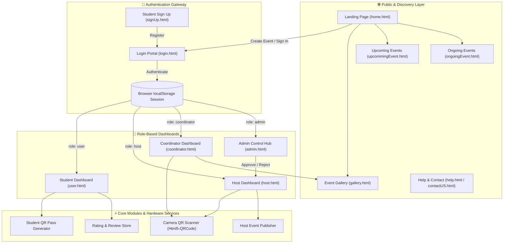

# CampusConnect — University Event Management Platform (EventDash-UI)

> A modern, role-based event management and discovery platform tailored for university campuses, student societies, coordinators, and administrators. Built with clean, native frontend web technologies.

---

## 📌 Project Overview & Objective

Campus event management is traditionally fragmented across spreadsheets, disparate messaging groups, paper forms, and disconnected ticketing services. **CampusConnect (EventDash-UI)** provides an integrated, all-in-one platform to orchestrate the entire event lifecycle:

1. **Discovery & Exploration**: Students explore upcoming workshops, hackathons, and cultural evenings directly from the public landing page.
2. **Unified Authentication**: Centralized, secure multi-role login separating Students, Society Hosts, Coordinators, and Administrators.
3. **Event Creation & Publication**: Club heads and hosts create, schedule, and publish events with venues, descriptions, and registration caps.
4. **Digital Attendance with QR Passes**: Instant student QR pass generation on the user dashboard coupled with camera-enabled live QR barcode scanning on host and coordinator dashboards.
5. **Community Memories & Gallery**: An interactive event gallery showcasing photography from keynotes, coding bootcamps, and cultural festivals.
6. **Feedback Loop**: Post-event 5-star ratings and student reviews stored in client storage for ongoing quality improvement.

---

## 🛠️ Technology Stack

In strict compliance with project architectural constraints, **no unnecessary frameworks, build tools, or third-party package dependencies** were introduced. The platform utilizes native, high-performance web standards:

| Layer | Technology | Description |
|---|---|---|
| **Markup** | **HTML5** | Semantic, accessible structures, SVG illustrations, responsive layouts, data attributes. |
| **Styling** | **CSS3** | Flexbox, CSS Grid, custom keyframe animations, glassmorphism, responsive media queries, CSS variables. |
| **Logic & Scripting** | **Vanilla JavaScript (ES6+)** | Native DOM manipulation, event listeners, dynamic table rendering, IntersectionObserver scroll animations, filter pipelines. |
| **Iconography** | **Bootstrap Icons (v1.11.3)** | Vector icons delivered via official jsDelivr CDN (`bi bi-*`). |
| **QR Code Engine** | **Html5-QRCode (v2.3+)** | Hardware camera scanner library loaded via unpkg CDN for mobile and desktop browser camera access. |
| **Theme Engine** | **Vanilla CSS3 & JS** | Persistent light/dark mode system (`theme.css` & `theme.js`) with system preference detection, dual toggles, and zero FOUC. |
| **Client Storage** | **Browser Web Storage API** | `localStorage` for role-based sessions, auth tokens, feedback records, student check-ins, and theme preferences. |

---

## 🏛️ System Architecture



---

## ✨ Features by Role

### 1. 🌟 Public Landing Page (`home.html`)
- **Direct Event Creation Flow**: "Create Your Event" hero and bottom call-to-action buttons redirect directly to `login.html`.
- **Animated Metrics Counter**: Dynamic counter ticking up to 500+ events, 25,000+ attendees, 40+ campuses, and 12+ cities via the `IntersectionObserver` API.
- **Synchronized Upcoming Events Feed**: Displays the real dummy events published by campus hosts:
  - 🚀 **Tech Fest 2026 - Day 1 (CodeStorm)** — Tech Club (Main Auditorium)
  - 💡 **Startup Pitch Meetup** — E-Cell & Host Desk (MBA Block Seminar Hall 3)
  - 🎭 **Annual Fest Rhythm (Cultural Night)** — Cultural Society (Open Air Amphitheatre)
  - 🤖 **Bot Wars Championship** — Robotics Chapter (Engineering Block Lab 4)
- **Authentic University Event Gallery Snapshot**: High-resolution, curated university event photography with hover tags and a direct link to the full archive.
- **Process Timeline**: 4-step interactive guide with flying SVG airplane animation.
- **Social Proof**: Testimonials and reviews from organizers and students.

### 2. 🔐 Authentication & Session Routing (`login.html`, `signUp.html`)
- Single entry point with a role dropdown selector (`Admin`, `Coordinator`, `Host`, `User`).
- Interactive password visibility toggle eye icon.
- Dynamic credential validation and role-based redirect.
- Persistent session storage in `localStorage` (`campusConnectAdminAuth` & `userRole`).

### 3. 🎓 Student / Attendee Dashboard (`user.html`, `user.js`)
- **Profile Overview**: Displays enrolled roll number, department, and academic year.
- **Event Tracker**: Real-time counter of registered, upcoming, ongoing, and past events.
- **Upcoming & Ongoing Directory**: Live search and category filters (Technical, Cultural, Workshop).
- **Event Registration**: One-click registration for active sessions.
- **Dummy Attendance QR Pass**: Automatically generates a unique, scannable QR pass for the student (`CC-PASS|CS2201|Student Name`).
- **Star Rating & Feedback**: 5-star interactive rating widget with persistent feedback reviews stored in `localStorage`.

### 4. 🎪 Host Dashboard (`host.html`, `host.js`)
- **Activity Metrics**: Total events hosted, active live sessions, total registrations, and average rating.
- **Event Publishing Engine**: Dedicated form to publish campus events with titles, dates, venues, and descriptions.
- **Camera QR Attendance Scanner**: Built-in hardware camera integration to scan students' QR passes and mark attendance.
- **Demo Scanner & Manual Verification**: "Demo Scan QR" simulation button and interactive Present/Absent toggle table.
- **Live Ticker**: Real-time announcement marquee of campus events.

### 5. 📋 Coordinator Dashboard (`coordinator.html`, `coordinator.js`)
- Society-specific event tracking across departments.
- Hardware camera QR code attendance scanner for door check-ins.
- Live attendance monitoring table with instant search by name or roll number.
- Direct Event Photo Uploader to submit new images to the Event Gallery.

### 6. 🛡️ Administrator Hub (`admin.html`, `admin.js`)
- **Host Onboarding Approval**: Accept or Reject prospective society hosts and faculty applicants.
- **Coordinator & Student Registry**: Tabular audit trail of registered coordinators and students across all departments.
- **Comprehensive Event Oversight**: Global view of all scheduled, live, and completed events.
- **Support Ticket Desk**: Queue of open and resolved technical inquiries.

### 7. 📸 Event Gallery Archive (`gallery.html`, `gallery.css`)
- Auto-advancing featured carousel with manual navigation controls.
- Categorized photo grid: Hackathons, Coding Bootcamps, Robotics Labs, Literary Fests, Sports Days, and Music Jams.
- Role-aware photo uploader visible exclusively to authenticated Hosts and Coordinators.

### 8. 🌓 Platform-Wide Light & Dark Mode System (`theme.css`, `theme.js`)
- **Complete Platform Coverage**: Active across all 13 pages (landing, gallery, auth portals, student, host, coordinator, and admin dashboards).
- **Zero FOUC (Flash of Unstyled Content)**: Pre-render theme initialization from `localStorage` prevents light flashes when navigating in dark mode.
- **Dual Toggle Interface**:
  - **Omnipresent Floating Toggle**: Accessible floating circle button with animated sun/moon icon at the bottom-right of every single page.
  - **Embedded Navbar Toggle**: Sleek header theme switchers on all top navigation bars.
- **Real-Time Cross-Tab Sync**: Automatically synchronizes theme adjustments across multiple open browser tabs via the `storage` event.
- **System Preference Awareness**: Intelligently defaults to the user's OS color scheme (`prefers-color-scheme: dark`) on initial visit.

---

## 📂 Project Structure

```text
EventDash-UI/
├── home.html               # Public landing page with hero, upcoming events, and gallery
├── home.css                # Styling for landing page, animations, and responsive grids
├── home.js                 # Scroll reveal observer, metric counter, and login redirect
├── theme.css               # Centralized light/dark theme stylesheet
├── theme.js                # Theme controller, storage manager, and toggle injector
├── gallery.html            # Event photo gallery, carousel slider, and upload module
├── gallery.css             # Slider and photo grid styling
├── upcommingEvent.html      # Filterable upcoming event catalog
├── upcommingEvent.css      # Upcoming event card grid styling
├── upcommingEvent.js       # Live search and category filter logic
├── ongoingEvent.html        # Live campus events with timers and progress bars
├── ongoingEvent.css        # Ongoing event styling with pulse badges
├── ongoingEvent.js         # Real-time search and filtering for active sessions
├── login.html              # Multi-role authentication portal
├── login.css               # Animated login container and form styling
├── login.js                # Credential verification and role dispatcher
├── signUp.html             # Student account registration portal
├── signUp.css              # Registration page styling
├── signUp.js               # Form handler and local account creation
├── user.html               # Student dashboard with QR Pass & Feedback
├── user.css                # User dashboard sidebar and dynamic views
├── user.js                 # Student state, QR generator, and rating engine
├── host.html               # Host management dashboard
├── host.css                # Host dashboard layout and tables
├── host.js                 # Event publisher, camera QR scanner, and attendees
├── coordinator.html        # Coordinator dashboard
├── coordinator.css         # Coordinator layout and table views
├── coordinator.js          # QR scanner and activity monitoring
├── admin.html              # Administrator oversight control hub
├── admin.css               # Admin layout, approval badges, and tables
├── admin.js                # Tabular switching, host approvals, and ticket resolution
├── registerEvent.html      # Standalone event registration form
├── registerEvent.css       # Registration form styles
├── contactUS.html          # Contact support page
├── contactUS.css           # Contact page styling
├── help.html               # Help Centre, FAQs, and support ticket submission
├── help.css                # Help Centre layout and accordion styles
├── images/                 # Local image assets
│   └── hero2.jpeg          # Hero graphic asset
└── README.md               # Complete platform documentation (this file)
```

---

## 🚀 Guide to Run and Use the Platform

### 1. Prerequisites & Necessary Requirements
- **Web Browser**: Any modern browser (Google Chrome, Microsoft Edge, Mozilla Firefox, or Apple Safari) with JavaScript enabled.
- **Camera Permission (Optional)**: If you test the live QR scanner on the Host or Coordinator dashboard, allow camera permissions when prompted by your browser.
- **Local Server (Recommended for Camera Access)**: Browsers require `http://localhost` or `https://` to grant web camera access to `getUserMedia`.

### 2. How to Launch

#### Option A: Using VS Code Live Server (Recommended)
1. Open the `EventDash-UI` folder in **VS Code**.
2. Right-click on `home.html` and select **"Open with Live Server"**.
3. Your browser will open the application at `http://127.0.0.1:5500/home.html`.

#### Option B: Using Python Built-in HTTP Server
Run the following command in the project directory:
```bash
python -m http.server 8000
```
Then navigate to: `http://localhost:8000/home.html`

#### Option C: Direct Browser Opening
Double-click `home.html` to open it directly in your web browser. (Note: Camera scanning requires a local HTTP server as per browser security policies; use the **"Demo Scan QR"** button to simulate scans if opening via file URI).

---

## 🔑 Demo Login Credentials & Testing Matrix

Use the credentials below to log into each role at `login.html`:

| Role | Username | Password | Target Dashboard | Key Features to Test |
|---|---|---|---|---|
| **Admin** | `admin` | `admin123` | `admin.html` | Review Host requests, click **Accept** / **Reject**, audit Coordinators, Students, and Support Tickets. |
| **Host** | `host` | `host123` | `host.html` | Publish a new event, open **Scan Attendance**, click **Start Camera** or **Demo Scan QR** to check in students. |
| **Coordinator** | `coord` | `coord123` | `coordinator.html` | Monitor society activities, launch camera attendance scanner, upload new photos to the gallery. |
| **Student (User)** | `user` | `user123` | `user.html` | Browse registered events, open **Attendance QR** to view personal student QR pass, submit a 5-star rating and feedback. |

---

## 🔄 End-to-End Testing Walkthrough

1. **Test Landing Page Redirection**:
   - Open `home.html`.
   - Click either the top hero **"Create Your Event"** button or the bottom **"CREATE YOUR EVENT"** button.
   - Verify that the page redirects directly to `login.html`.
2. **Test Upcoming Events & Gallery**:
   - On `home.html`, scroll to **Upcoming Events** (Section 5).
   - Observe the 4 distinct cards matching the host published events (`Tech Fest 2026 - Day 1`, `Startup Pitch Meetup`, `Annual Fest Rhythm`, `Bot Wars Championship`) with high quality university event photography, tags, and register buttons.
   - Scroll down to **Event Gallery** (Section 6) and verify the 4 distinct university event photographs (Keynote, Hackathon, Cultural Stage, Robotics Arena) and the `>` button leading to `gallery.html`.
3. **Test Full QR Attendance Loop**:
   - Log in as **User** (`user` / `user123`).
   - Click **Attendance QR** in the sidebar. Note your student roll number `CS2201`.
   - In another tab, log in as **Host** (`host` / `host123`).
   - Click **Scan Attendance** from the sidebar.
   - Click **Start Camera** to scan the pass, or click **Demo Scan QR**.
   - Notice the status updates to `QR Scanned & Attendance Marked!` and student `Ananya Patra (CS2201)` is marked **Present**.
4. **Test Host Event Creation**:
   - In the Host dashboard, click **Create Event**.
   - Fill in an event title, date, venue, and description, and click **Publish Event**.

---

## 🛡️ License

Developed as part of the CampusConnect initiative for university event automation and student engagement. All rights reserved.
